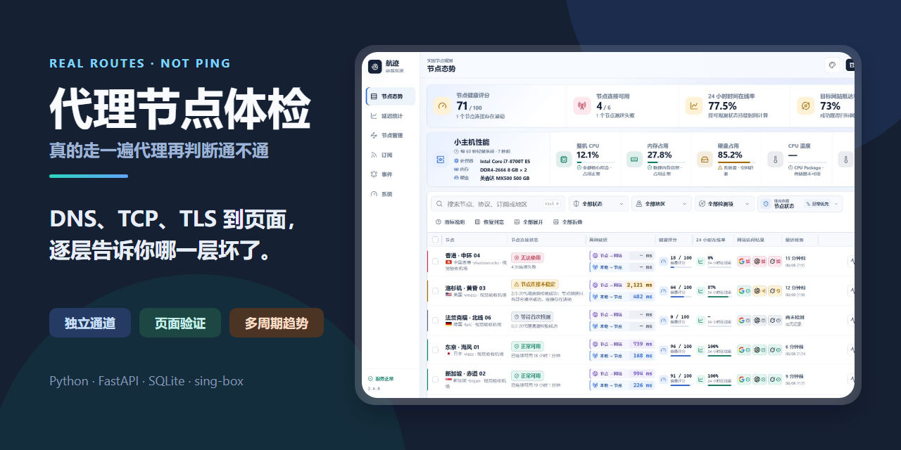
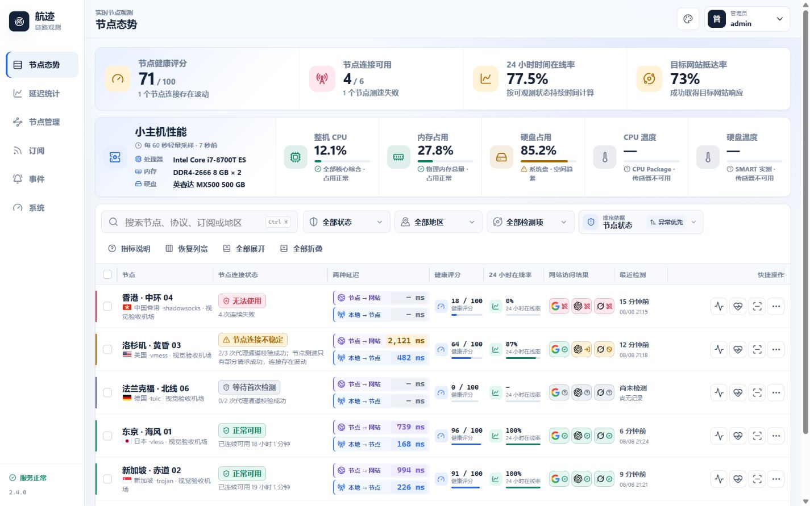

# 航迹 / Trailmark — 代理节点可用性监控

[简体中文](README.md) · [English](README_EN.md)

[](https://github.com/ferretgeek/Trailmark/actions/workflows/ci.yml)
[](https://github.com/ferretgeek/Trailmark/actions/workflows/codeql.yml)
[](LICENSE)
[](https://www.python.org/)



航迹不是 Ping 面板。每次检测都会为目标节点启动一条短生命周期、相互隔离的
sing-box 代理通道，并通过该通道访问已启用的目标。系统综合 DNS、TCP、TLS、
跳转、响应耗时和页面特征判断实际可用性。

当前开源版本：`2.4.1`。项目以 [MIT License](LICENSE) 发布，可自由使用、
修改与分发；第三方图标、国旗和品牌标识遵循各自许可证或权利声明，详见
[第三方声明](THIRD_PARTY_NOTICES.md)。

> 本仓库只包含程序源码、迁移、测试、部署脚本和脱敏文档，不包含任何真实
> 订阅、节点凭据、管理员密码、数据库、运行日志或服务器连接信息。

## 快速开始

### 本机运行

本机模式只监听 `localhost`，数据、日志和运行密钥保存在已忽略的 `.local-run/`
中，不修改系统服务。先安装 Python 依赖和 sing-box，再运行：

```powershell
python -m venv .venv
.\.venv\Scripts\python.exe -m pip install -r requirements.txt
.\.venv\Scripts\python.exe scripts\run-local.py --sing-box "C:\path\to\sing-box.exe"
```

Linux/macOS 使用 `.venv/bin/python scripts/run-local.py --sing-box /path/to/sing-box`。
首次启动会在终端中创建至少 14 位的本地管理员密码。需要迁移数据时，完整复制
`.local-run/`；不要把该目录提交或分享。

### Linux 服务器部署

生产部署面向带 `systemd` 的 Linux 主机，安装脚本会创建独立系统用户、受限
服务、健康检查和容量保护。先在源码根目录生成发布包与至少 14 位的管理员
密码文件：

```bash
tar -czf /tmp/airport-monitor-release.tar.gz \
  --exclude='*/__pycache__' --exclude='*.pyc' \
  .env.example app deploy docs scripts README.md README_EN.md LICENSE \
  SECURITY.md THIRD_PARTY_NOTICES.md requirements.txt requirements-dev.txt
umask 077
openssl rand -base64 24 > /tmp/airport-monitor-admin-password
```

然后执行安装：

```bash
sudo bash scripts/install.sh \
  --archive /tmp/airport-monitor-release.tar.gz \
  --bind-host <服务器局域网IP> \
  --admin-password-file /tmp/airport-monitor-admin-password \
  --port 18080
```

安装成功后立即从受限密码文件登录，并把该文件转移到安全的密码管理器；确认
可登录后再删除服务器上的临时密码文件。Windows 管理端也可使用
`scripts/New-DeploymentCredential.ps1` 生成随机密码和受限凭据文件。

完整的安装、更新、备份、恢复与卸载流程见
[部署与运维](docs/部署与运维.md)。首次公开部署前请先阅读
[安全策略](SECURITY.md)，并确认监听地址没有直接暴露到公网。

## 已实现能力

- 订阅添加、编辑、删除、启停、自动刷新与安全脱敏。
- Base64 URI、Clash YAML、sing-box JSON，以及 SS、VMess、VLESS、Trojan、
  Hysteria2、TUIC、SOCKS、HTTP 和 AnyTLS 节点解析。
- 整份订阅、全部节点、批量节点和指定单节点检测。
- 默认检测 Google、ChatGPT 和 Grok；X、Claude、Wikipedia、GitHub、Node.js、
  Python、Perplexity、YouTube、Nexus Mods、Hugging Face、Cloudflare 和
  Linux.do 可选启用，升级不会改变当前选择。
- 超时、重试、随机抖动、动态并发和有界队列；离线节点默认每 10 分钟持续
  完整复测，不会因连续失败永久退出队列。
- 正常、需要登录、地区限制、服务阻断、响应异常、结果不确定、
  DNS/TCP/TLS/代理错误和完全不可达的独立判定。
- 安全挑战中间页只作为“目标网站已经响应”的证据，按正常到达处理，不单列
  状态，也不降低节点健康度。
- 连续在线时间、按真实状态持续时间计算的 24 小时/7 天/30 天可用率、
  覆盖率与置信度、平均/P50/P95 延迟、服务状态、排名、趋势、事件和资源指标。
- 每个节点固定分开显示两种延迟：“节点 → 网站”是完整网站访问耗时；
  “本地 → 节点”由局域网监测小主机通过完整代理协议链路访问固定轻量
  `204` 目标，连续 3 次取中位数。TCP 端口/CDN/Anycast 入口握手只作为
  内部诊断，不覆盖主延迟，也不参与节点健康判定。
- 高密度节点列表、国家/地区与国旗、搜索/筛选/分页/批量复测；状态、地区、
  检测项、每页数量、趋势范围、地区修正、刷新周期和排序全部使用与面板统一的
  自定义菜单，并把“节点 → 网站”和“本地 → 节点”作为两个独立排序依据；
  节点管理
  提供常驻的全选、批量启用、批量停用和逐行启停按钮，无需进入详情页。每个
  节点可独立折叠延迟与健康趋势；趋势按需加载并最多返回 192 个聚合点。
- 桌面节点表的十列均可像 Excel 一样拖动表头边界调整宽度，方向键可精确微调；
  当前浏览器会自动记忆宽屏和紧凑桌面布局，并可一键恢复自适应默认列宽。
- 首页只呈现启用节点，并以每 60 秒一次的轻量采样展示整机 CPU、内存、
  系统盘占用、CPU Package 温度和硬盘 SMART 温度；CPU 为全部核心综合后的
  0～100% 口径，不按核心相加，传感器缺失时明确显示不可用。首页关键评分与
  性能数值采用放大、加粗层级，硬件型号由后端部署元数据提供，在高缩放和
  手机布局下仍完整换行。
- 通过节点自身代理获取出口 IP，并由 Cloudflare Trace、ipwho.is、ipapi.co
  多来源核对；至少两个来源一致才更新，只保存脱敏 IP。
- 任务暂停、手动复测、安全 CSV 导出、通用 Webhook 通知。
- 每 30 秒记录监测机网口状态；网线断开时暂停节点归责，恢复后清理旧等待状态
  并立即全量复测。监测机离线时段独立计入覆盖信息，不计作节点成功或失败。
- SQLite WAL、查询索引、20 天原始数据、180 天小时聚合和自动清理。
- 日志 8 GiB 软限制/10 GiB 硬限制，全部持久化数据 12 GiB 软限制/
  15 GiB 硬限制；应用和独立系统定时器双重执行容量保护。
- 右上角全局主题入口提供天际蓝、青岚绿、霞光橙三套浅色主题和深灰夜色主题，
  选择会持久保存并覆盖全部页面、弹窗、表格、图表和交互状态；同时支持响应式
  布局、键盘焦点和减少动态效果。全部检测项使用本地品牌标识，健康评分和在线率
  由明确数值、图标、中文标签和横向进度表达，服务状态不使用含糊叠加点。
- 30 天固定有效期的服务端会话、CSRF、客户端绑定、来源与 Host 校验、登录
  限速、主动退出失效和敏感配置加密。

## 界面预览



预览使用从零生成的节点、订阅和状态数据，不含真实订阅、出口地址、账号、服务器
或设备身份。项目同时提供 SVG 与 ICO 浏览器图标，并已在本机与服务器路由验证。

## 运行架构

平台采用一项独立 `systemd` 服务，不安装 Docker，不创建透明代理，不修改
服务器路由、DNS、防火墙或已有服务。主进程和临时检测进程位于同一受限
cgroup：CPU 上限 75% 单核配额、内存上限 768 MiB、低 CPU/I/O 权重、较低
进程优先级，默认最多同时检测 3 个节点。

| 内容 | 位置 |
|---|---|
| 当前程序 | `/opt/airport-monitor/current` |
| 版本目录 | `/opt/airport-monitor/releases` |
| SQLite 数据 | `/var/lib/airport-monitor` |
| 加密配置 | `/etc/airport-monitor/env` |
| 应用日志 | `/var/log/airport-monitor` |
| 备份 | `/var/backups/airport-monitor` |

部署、更新、备份、恢复和卸载方法见
[部署与运维](docs/部署与运维.md)，安全边界与检测原理见
[技术与安全设计](docs/技术与安全设计.md)。

## 本地验证

```powershell
python -m venv .venv
.\.venv\Scripts\python.exe -m pip install -r requirements-dev.txt
.\.venv\Scripts\python.exe -m pytest -q
```

Linux/macOS：

```bash
python3 -m venv .venv
.venv/bin/python -m pip install -r requirements-dev.txt
.venv/bin/python -m pytest -q
```

环境变量字段见 `.env.example`。`AIRPORT_HARDWARE_CPU`、
`AIRPORT_HARDWARE_MEMORY` 和 `AIRPORT_HARDWARE_DISK` 仅用于展示设备型号；
实时占用和温度仍来自系统采样。真实密钥、订阅链接和管理员密码不得写入源码。
第三方前端图标使用 Lucide，授权文本位于
`app/static/vendor/LUCIDE-LICENSE.txt`；补充地区国旗来自 MIT 授权的
flag-icons，授权文本位于 `app/static/flags/LICENSE-flag-icons.txt`。

## 参与贡献

提交修改前请运行完整测试，并避免把真实订阅、节点配置、数据库、日志、截图或
环境文件加入仓库。具体约定见 [CONTRIBUTING.md](CONTRIBUTING.md)。安全问题请
按 [SECURITY.md](SECURITY.md) 私下报告，不要在公开 Issue 中披露可利用细节或
真实凭据。
